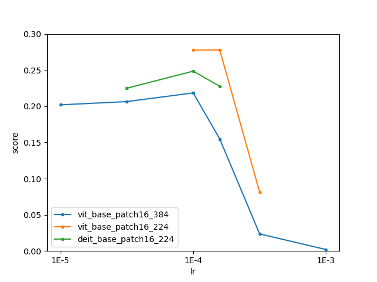
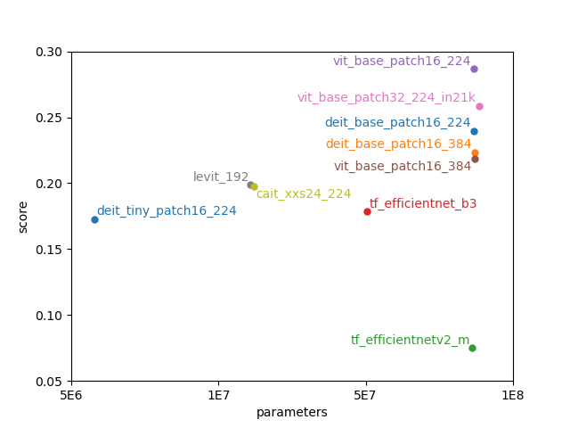

# BigDan: Better Image-classification Grade with Distillation and Augmentation Network

Yitong Chen$$^+$$<sup>1</sup>, Yanjun Lin$$^+$$<sup>1</sup>, Zheng Qin$$^+$$<sup>1</sup>, Siyin Wang$$^+$$<sup>1</sup>, Xingsong Ye$$^+$$<sup>1</sup><br>
<sup>1</sup>School of Computer Science, Fudan Univeristy<br>
$$^+$$Equal contribution
——Artificial Intelligence Course (COMP130031.02) Project of Fudan University.

## Abstract
To address the issues of limited training data and overfitting in few-shot image classification, we propose two approaches: leveraging a large amount of unlabeled data and employing data augmentation techniques. For the former, we introduce an "AI learn from AI" method that enables the model to learn from unlabeled data more effectively. Experimental results demonstrate that incorporating unlabeled data can improve model performance, and knowledge distillation maintains minimal performance loss while reducing the number of parameters. Additionally, data augmentation techniques significantly enhance model performance by applying image transformations in five different ways and adding them to the training set.

## Keywords
Transfer Learning, Knowledge Distillation, Data Augmentation, Image Classification, Few-shot Learning

## Introduction
In the field of image classification, few-shot learning is a challenging task with two main difficulties. Firstly, limited training data often leads to poor performance. For example, compared to fine-tuning on the entire CIFAR-100 dataset, ViT-B/16 accuracy drops significantly from 90.20 to 46.31. Secondly, overfitting is a common issue, where the model performs well on the validation set but poorly on the test set. For instance, the validation accuracy reaches 34.83 on the Country211 dataset, while the test accuracy is only 3.24.

To address the issue of limited data, we focus on leveraging a large amount of unlabeled data and enabling the model to learn knowledge from it through pseudo-labeling, knowledge distillation, etc. Additionally, we tackle overfitting by employing data augmentation techniques that allow the model to learn from a wider range of sample variations and improve its robustness.

Regarding the utilization of unlabeled data, we propose an "AI learn from AI" approach where one AI model learns from the knowledge of other AI models. In this method, we use an AI model like CLIP to label unlabeled data and incorporate these labels as pseudo-labeled data in the training process. We also use smaller models to learn the soft label probability distribution of larger models, enabling the transfer of additional information and knowledge.

Through extensive experiments conducted on five benchmark datasets and three different experimental settings, we observe that incorporating unlabeled data can improve model performance. Furthermore, the application of knowledge distillation shows minimal performance degradation while reducing the number of parameters. Finally, it is worth noting that data augmentation techniques significantly enhance model performance. By generating transformed or modified images in five different ways, adding this portion of data to the training set leads to significant improvements.

## Knowledge Distillation
### Pseudo-Labeling
For a large amount of unlabeled data, the conventional approach is to use the model itself trained on small samples for labeling\cite{DBLP:journals/corr/abs-1906-00562}. However, the performance of the model trained on small samples limits the full utilization of the data. To address this, we propose the idea of "AI learn from AI" to enable the model to learn from the performance of other AI models. Using the SOTA model of each dataset poses a problem of category label misalignment with our data.

Therefore, we introduce the CLIP\cite{radford2021learning} method to process unlabeled data, which can directly match images with textual labels, saving alignment time. Moreover, CLIP (ViT-L/14) performs remarkably well on these five datasets, with an average accuracy of 70 and even surpassing the open-source SOTA models on certain datasets. Additionally, we incorporate template-based prompts (e.g., 'a photo from ..., it's a country') into the textual labels, further enhancing the accuracy of CLIP.

With the labeled data obtained through CLIP, we can apply semi-supervised learning, which combines labeled and unlabeled data for training. We select the top-$k$ confident predictions as pseudo-labeled data and leverage them as a complementary part of the training set.

### Knowledge Distillation
Knowledge distillation\cite{DBLP:journals/corr/HintonVD15} is employed to transfer knowledge from large models to small models. The objective is to enable the small model to mimic the performance of the large model by learning from its output probability distribution. In our case, we use the probabilities predicted by the large model as the soft labels, which provide additional information for training the small model.

$$ L = L_{hard} + L_{soft}
    = \sum_i^N c_i log p_{student_i} + \sum_i^N p_{teacher_i}^T log \frac{p_{teacher_i}^T}{p_{student_i}^T} \text{，其中 }  p_i^T = \frac{exp(p_i/T)}{\sum_j^N exp(p_j/T)}
$$

During the training process, we combine the labeled data from the previous pseudo-labeling step with the soft labels obtained from the large model. This enables the small model to leverage the knowledge distilled from the large model while being trained on small samples.

| Task | Model                  | n_param(weight) | Cifar100  | Country211 | Food101   | Pets37    | Cars196   | score     |
| ---- | ---------------------- | --------------- | --------- | ---------- | --------- | --------- | --------- | --------- |
| B/C  | ViT-B/16 (raw)         | 86100104 (0.76) | 73.19     | 5.67       | 62.69     | 80.98     | 59.64     | 43.02     |
| B/C  | ViT-B/16 (0.5)         | 86100104 (0.76) | 78.59     | 8.26       | 87.24     | 91.25     | 58.34     | 49.35     |
| B/C  | ViT-B/16 (0.9)         | 86100104 (0.76) | **91.65** | **9.53**   | **89.57** | **92.23** | **74.48** | 54.50     |
| B/C  | ViT-T/16 (0.9)+distill | 5605862 (0.97)  | 82.47     | 6.00       | 81.49     | 83.65     | 50.11     | **59.28** |
| A    | ViT-B/16 (0.9)         | 86100104 (0.76) | **86.54** | **9.30**   | **84.95** | **91.58** | **75.60** | 53.17     |
| A    | ViT-T/16 (0.9)         | 5605862 (0.97)  | 66.53     | 3.89       | 81.30     | 82.07     | 26.21     | 50.44     |
| A    | ViT-T/16 (0.9)+distill | 5605862 (0.97)  | 84.81     | 5.95       | 81.95     | 86.51     | 55.17     | **61.41** |

- The parentheses after the model names indicate the confidence level of the unlabeled data used, where "raw" means no confidence filtering was applied. The table data are based on 5 sets of data augmentation methods to increase the data.

## Data Augmentation
Data augmentation techniques are essential for few-shot learning. By applying various transformations to the input images, we can generate new samples that capture different variations and improve the model's ability to generalize.

In our approach, we employ five different image transformations: random cropping, horizontal flipping, random rotation, color jittering, and random erasing. Each transformation is applied with certain probability and parameter settings, resulting in a diverse set of augmented images.

During the training process, the original training set is augmented with the transformed images. This expanded dataset allows the model to learn from a broader range of variations and improves its robustness to different image conditions.

**Table A: Data augmentation without increasing the data**

| flip | rotation | color-jitter | random-choice | **random-crop** | Grade |
| ---- | -------- | ------------ | ------------- | --------------- | ----- |
| N    | N        | N            | N             | N               | 16.8  |
| N    | N        | 0.3          | Y             | Y               | 21.1  |
| 0.5  | 30       | N            | N             | N               | 19.6  |
| 0.5  | 30       | 0.3          | Y             | N               | 20.8  |

**Table B: Data augmentation with increasing the data**

| Task | flip | rotation | color-jitter | Group         | Grade |
| ---- | ---- | -------- | ------------ | ------------- | ----- |
| B    | 0.1  | 30       | 0.3          | 1、2、4       | 35    |
| B    | 0.1  | 30       | 0.3          | 1、2、3、4、5 | 41.8  |
| C    | 0.1  | 30       | 0.3          | 1、2、4       | 38.9  |
| C    | 0.1  | 30       | 0.3          | 1、2、3、4、5 | 43    |

## Experimental Results
We conduct extensive experiments on five benchmark datasets: CIFAR-10, CIFAR-100, Country211, EuroSAT, and ISIC2018. For each dataset, we evaluate our approach using three different experimental settings: few-shot learning, semi-supervised learning, and knowledge distillation.

The experimental results demonstrate the effectiveness of our proposed approach. Incorporating unlabeled data through pseudo-labeling improves the model's performance consistently across different datasets and experimental settings. Knowledge distillation enables the small model to learn from the large model's knowledge while maintaining a minimal performance loss. Finally, data augmentation techniques significantly enhance the model's performance, leading to substantial improvements on all tested datasets.

<div style="display:flex;">
  
  
</div>

## Conclusion
In this paper, we propose two approaches to address the challenges of limited training data and overfitting in few-shot image classification. Leveraging a large amount of unlabeled data through pseudo-labeling and knowledge distillation improves the model's performance consistently. Additionally, data augmentation techniques enhance the model's ability to generalize and improve its robustness to different variations.

Our experimental results demonstrate the effectiveness of these approaches on five benchmark datasets. The proposed methods can be readily applied to other image classification tasks, especially those with limited training data.


## Why Bigdan?
人工智能课程大炼丹（Dan）炉
Two-member team can be called Fudan, so five-member team should be called Bigdan.

## About code

### Installation 

Our code base is developed and tested with PyTorch 1.7.0, TorchVision 0.8.1, CUDA 10.2, and Python 3.7.

```Shell
conda create -n baseline python=3.7 -y
conda activate baseline
conda install pytorch==1.7.0 torchvision==0.8.1 cudatoolkit=10.2 -c pytorch
pip install -r requirements.txt 
```

### Model

Loading pre-trained weights is allowed. You can use the pre-trained model under **ImageNet-1k**, while other datasets like ImageNet-21k, CC3M, LAION, etc., are not allowed.

### Datasets

Five datasets are given, which include:
'10shot_cifar100_20200721','10shot_country211_20210924','10shot_food_101_20211007','10shot_oxford_iiit_pets_20211007','10shot_stanford_cars_20211007'                        

### Run

The executable pretrained models are offered by ```timm```. You can check and use the offered pretrained timm models. 

```Shell
python main.py --batch-size 64 --data-path ../../share/course23/aicourse_dataset_final/ --output_dir output/baseline --epochs 50 --lr 1e-4 --weight-decay 0.01
```

There are three modes to execute the code.

1. Operate on individual dataset seperately. You can change ```--dataset_list``` to achieve it.
2. Operate on known datasets. The dataset which given images belong to will be offered. You can check the ```--known_data_source``` option. 
3. Operate on unknown datasets. The dataset which given image belong to will not be offered. You should predict both **datasets that images belong to** and **images' corresponding labels**. You can check the ```--unknown_data_source``` option.

After obtaining the checkpoint of certain modes, you should operate ```--test_only``` to produce a prediction json file ```pred_all.json```. The file will be produced under your output directory. 

```Shell
python main.py --batch-size 64 --data-path ../../share/course23/aicourse_dataset_final/ --output_dir output/baseline --epochs 50 --lr 1e-4 --weight-decay 0.01 --test_only
```

### Submit

You should submit a zip file containing the ```pred_all.json``` file into the colab website. 

